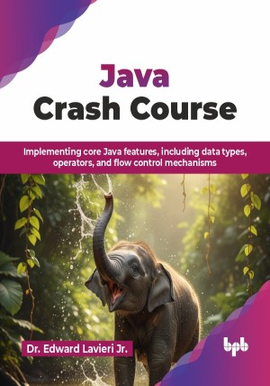

# Java Crash Course

Implementing core Java features, including data types, operators, and flow control mechanisms.

This is the repository for [Java Crash Course
](https://bpbonline.com/products/java-crash-course?_pos=1&_sid=b0265ee2f&_ss=r?variant=44827484029128),published by BPB Publications.

## About the Book
Java is one of the most prevalent programming languages today, powering everything from enterprise applications to mobile platforms. It is the backbone of the global enterprise software industry and a major player in the mobile and big data ecosystems, valued for its performance, stability, and platform independence. 

This book takes you step-by-step from the basics of Java syntax, data types, and control structures, through core object-oriented programming concepts, to advanced topics like concurrency, streams, and graphical user interfaces. Along the way, you can learn how to handle exceptions, work with collections, connect to databases, and gain experience with modern Java features such as lambdas and functional programming. Hands-on exercises, real-world projects, and clear examples can reinforce your understanding and provide practical skills you can apply immediately.

By the end of this book, you should not only understand Java but also have the confidence to build scalable, efficient applications and tackle real-world coding challenges with ease. Whether you are a student, developer, or IT professional, you will be fully equipped to understand, write, debug, and deploy high-quality, professional-grade Java code.

## What You Will Learn
• Understand Java fundamentals for creating scalable and efficient code.

• Learn object-oriented programming principles.

• Explore modern Java tools to write clean code.

• Apply Java programming to solve real-world problems.

• Develop skills for career advancement in software development roles.

• Analyze thread dumps, heap dumps, and flight recorder data for complex debugging.

• Build reactive, non-blocking APIs using the Flow API and back-pressure techniques.
